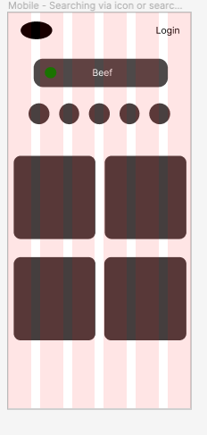
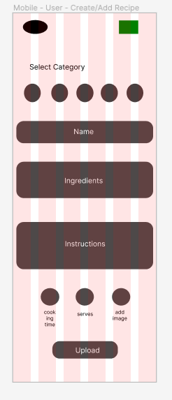

# full stack app


link to Trello Implementation plan [_here_](https://trello.com/b/cbYkzz9g/full-stack-app).

## Table of Contents

- [full stack app](#full-stack-app)
  - [Table of Contents](#table-of-contents)
- [**General Information**](#general-information)
- [**Tech stack**](#tech-stack)
- [**Development Team**](#development-team)
- [**Dataflow Diagram**](#dataflow-diagram)
- [**Application Architecture Diagram**](#application-architecture-diagram)
- [**User Stories**](#user-stories)
- [**Implementation plan**](#implementation-plan)
  - [**screenshots**](#screenshots)
- [**Wireframes**](#wireframes)
- [End Points](#api-endpoints)
- [Testing](#tests)
  - [Development testing](#development-testing)
  - [Production testing](#production-testing)
- [**References**](#references)

<br>
<br>

# **General Information**

- **Purpose**

  The purpose of this app is to provide a centralised location for individuals to store and access their favorite recipes in one convenient place. The app allows users to easily filter recipes based on specific ingredients or dietary restrictions, making meal planning and recipe discovery more efficient. The user-friendly interface makes it easy to navigate through your recipe collection and plan your meals for the week. With this app, busy working professionals, food enthusiasts, or anyone looking to keep their recipe collection organized, can access their recipes on the go, and never have to worry about losing their favorite recipes again. This app is designed to make meal planning and recipe discovery a breeze and help you to create delicious and healthy meals.

- **Functionality / features**

  The app provides a user-friendly interface that allows users to easily search, filter, and organize their favorite recipes. The app's search function allows users to quickly find specific recipes by keyword or ingredient. Users can filter recipes based on dietary restrictions, meal type, and more. Once users have found a recipe they like, they can save it to their personal recipe collection for easy access in the future.

  The app also allows users to plan their meals for the week by filtering recipes based on specific ingredients or dietary restrictions. This feature makes it easy to plan out a week's worth of meals and ensure that you have all the ingredients on hand. Users can also view a random selection of the top-rated recipes on the homepage, which gives them the opportunity to discover new and exciting recipes.

  The app's CRUD functionality allows users to add, view, update and delete their own personal recipe collection. This feature ensures that users have full control over their recipe collection and can easily update, add or delete recipes as needed. Users can also rate and comment on recipes, and get feedback and suggestions from other users.

- **Target audience**

  The target audience for this app would be busy working professionals, food enthusiasts and families. These groups of people have different needs but they all share a common goal, which is to make meal planning and recipe discovery easy and efficient.

  Busy working professionals often have limited time to plan and prepare meals, and they would benefit greatly from an app that allows them to easily find and save recipes, and plan their meals in advance. This app's search and filter functionality and meal planning capabilities would be especially useful for this group, as they could quickly find recipes that fit their dietary restrictions and schedule.

  Food enthusiasts are always looking to discover new and exciting recipes, and this app would be a great resource for them. The app's search and filter functionality would allow them to find new recipes based on their interests, and the ability to save and organize their favorite recipes would make it easy for them to try out new recipes in the future.

  Families often have to consider different dietary restrictions and preferences when planning meals, this app's search and filter functionality and meal planning capabilities would make it easy for them to find and plan meals that everyone in the family will enjoy. Additionally, the CRUD functionality would allow each member of the family to save and organize their own personal recipe collection, making meal planning even more efficient for the whole family.
  <br>
  <br>

# **Tech stack**

**Express:**

- Express is a web application framework for Node.js that provides a robust set of features for web and mobile applications. It is used in this app to handle routing and handle HTTP requests and responses. It is responsible for handling the server-side logic of the application.

**MongoDB:**

- MongoDB is a NoSQL database that is used to store and retrieve data for the application. It is used in this app to store and retrieve user data such as recipes and user's information.

**React:**

- React is a JavaScript library for building user interfaces. It is used in this app to handle the client-side logic of the application and for building the front-end of the application.

**Node.js:**

- Node.js is an open-source JavaScript runtime environment that enables the use of JavaScript on the server-side. It is used in this app to run the server-side logic of the application and to handle the communication between the front-end and back-end.

**JWT Token:**

- JSON Web Token (JWT) is an open standard for creating and transmitting access tokens. It is used in this app to authenticate and authorize users, ensuring that only authorized users can access certain routes and resources.

**Bcrypt:**

- Bcrypt is a password hashing function that is used to encrypt and secure user passwords. It is used in this app to hash and store user passwords in the database, ensuring the security of user data.

**Vite:**

- Vite is a build tool and development server that is designed to be fast and lightweight. It can be used in this app to improve the development experience and to speed up the building and serving of the application.

**Cloudinary:**

- Cloudinary is a cloud-based image and video management platform that can be used to store, manipulate, and deliver media files. It can be used in this app to handle the storage and delivery of images and videos for the application.

**Jest:**

- Jest is a JavaScript testing framework that can be used to test the functionality of the application. It can be used in this app to write unit tests for the server-side and client-side logic of the application.

**Multer:**

- Multer is a middleware for handling multipart/form-data, which is primarily used for handling file uploads. It can be used in this app to handle the image uploads in the application.

**Vitest:**

- Vite + Jest. It is a testing framework that allows to run Jest test on Vite, providing a fast and efficient way to test the application.

**Supertest:**

- Supertest is a library for testing Node.js HTTP servers. It can be used in this app to test the Express routes and endpoints by making HTTP requests and asserting on the responses.

**Cors:**

- Cors is a middleware that can be used to enable cross-origin resource sharing (CORS) in the application. It can be used in this app to configure the server to allow requests from different origins, ensuring that the front-end can communicate with the back-end without any issues.
  <br>
  <br>

# **Development Team**

- Dale Dahlenburg - [@github.com/daledburg](https://github.com/daledburg)

  - Dale Dahlenburg is responsible for the backend development of the app. He is responsible for developing and maintaining the server-side of the application, including creating and managing the database, handling user authentication and authorization, and implementing the app's API. He is also responsible for ensuring that the app's performance is optimized and that it can handle a large number of users.
    <br>
    <br>

- Divij Seth - [@github.com/DjSeth1](https://github.com/DjSeth1)

  - Divij Seth is responsible for the frontend development of the app. He is responsible for designing and implementing the user interface, creating interactive features, and ensuring that the app is responsive and user-friendly. He is also responsible for creating the visual elements of the app, such as icons, images, and layouts.
    <br>
    <br>

- Mitchell Roger - [@github.com/roger2727](https://github.com/roger2727)
  - Mitchell Roger is responsible for both the backend and frontend development of the app. He is also responsible for managing the repository, ensuring that the codebase is well-organized and easy to navigate. He is also responsible for testing the code, ensuring that the app is working correctly and fix any bugs found during the testing process. He is also responsible for the deployment of the app, which includes configuring the necessary servers, databases and environments, and making sure that the app is properly configured for production.

# **Dataflow Diagram**


First of all is the main concept diagram. This provides a brief overview of what the minimum viable product(MVP) would look like. The whole projects itself is about managing the recipes that the users find valuable. It will also allow other users to browse and comment on others entered recipes.


Shows the data flow for the login and registration process.


Shows the data flow for the recipe creation and viewing process.

# **Application Architecture Diagram**


# **User Stories**

1. As a busy working professional, I want to be able to quickly search for recipes by keyword or ingredient so that I can find something to make for dinner tonight. It is important as a busy working professional does not have time to sift through each recipe to see if the ingredients they have at home are substantiated enough to make the meal.

2. As a food enthusiast, I want to be able to filter recipes by meal type or dietary restriction so that I can discover new and exciting recipes to try. As a food enthusiast it is important to learn creative and inspiring ways to create my own recipes.

3. As a family person, I want to be able to plan my meals for the week by filtering for specific ingredients or dietary restrictions so that I can ensure that we have everything we need on hand.

4. As a busy working professional, I want to be able to save my favorite recipes for easy access in the future so that I don't have to search for them again.

5. As a food enthusiast, I want to be able to rate and comment on recipes so that I can share my thoughts with other users and get feedback and suggestions.

6. As a family person, I want to be able to view a random selection of the top-rated recipes on the homepage so that I can discover new and exciting recipes to try.

7. As a busy working professional, I want to be able to update and delete my own personal recipe collection so that I can keep it organized and up-to-date.

8. As a food enthusiast, I want to be able to easily find recipes that fit my dietary restrictions so that I can continue to eat healthy and delicious meals.

9. As a family person, I want to be able to add my own recipes to the app so that I can share my family's favorite recipes with others.

10. As a busy working professional, I want to be able to access my recipe collection from my phone so that I can plan my meals on the go.

<br>
<br>

# **Implementation plan**

link to Trello Board [_here_](https://trello.com/b/cbYkzz9g/full-stack-app).

So, in our project, we decided to use Trello to manage and delegate tasks among the team members. Trello is a visual tool that makes it easy to organize and track tasks. At the start of the project, we all had a meeting to discuss and assign tasks to each team member. Each team member was responsible for a specific task, which was added to the "To-Do" card on Trello. This card listed all the tasks that needed to be completed for the project.

As we started working on the tasks, we would drag the task from the "To-Do" card to our assigned card on Trello. This way, the team could see who was responsible for each task and the progress of each task. Once we completed a task, we would move it from our assigned card to the "Completed" card on Trello. This helped us keep track of what had been done and what still needed to be done.

After some more consideration after days 1 and 2, we revised our Kanban board to reflect the stages each task went through, as a result we added a to do, doing, review and testing steps before adding it into the completed category. Now our strategy encompassed a group wide review before completing the task, as well as gaining a better understanding of where each ticket was in the process of our agile method. We had also added additonal user stories upon reflection, to better capture the needs of our target audience.

We also had a daily stand up where we discussed what to do next, what we are working on, and if there are any blockers or questions. Then these were made into tickets, during this meeting we also looked to refine our user stories to ensure that our tasks were purposeful.

Overall, this process allowed for clear communication and organization within the team, and helped us ensure that all tasks were completed in a timely manner. It also allowed each of us to focus on our specific tasks and not get overwhelmed by the entire project.
<br>

### **screenshots**


# **Wireframes**

View full [_here_](https://www.figma.com/file/tyqI6h3s5vTSop0jik7XRy/RecipeAppWireframes?node-id=0%3A1&t=4RVm5VoRq2MnVuBQ-1)
Created using Figma.

1. Landing Pages

   - This page is where the user will land, and navigate to different parts of the app. This will feature a search bar, aswell as categories of recipies they can filter by with a simple click of the icon. It will feature a carousel display of recipes which can be hovered and clicked on to access. They are neatly organised into a random list of recipes which be under "Today's picks" and a rated list of "Trending" recipes. Below are the mobile and desktop versions.

   

   

2. Search Functionality

   - The search function, by icon or search bar re-renders a list of recipes that match the search criteria. Below images show what this will look like in desktop and mobile versions. This will be added in the next sprint as we build out the search functionality.
   - 
   - 

3. View Recipe.
   - Once the recipe has been selected by a user, via a click or going through the hover and view. The full details of the recipe will be available for their viewing. In this, if the user is logged in, they can save the recipe, as well as rate the receipe. There are two buttons that can be used to alternate between the ingredients and the instructions to be displayed.
   - 
   - 
4. Sign Up and Login.

   - These can be accessed via the nav menu. Or if the user wishes to save a recipe or give it a rating. The user will be prompted to login or sign up. Upon sucessful login or sign up. The user will be re-directed to the homepage. Below are wireframes for login and sign up.
   - 
   - 
   - 
   - 

5. User Homepage

   - User's personal homepage with Today's picks and Trending section. The nav bar will now contain a place for favourited recipes. Creating recipes aswell as accessing their own reciepes. These navigate to a list the aforementioned recipe componenents which will be shown next. Below is a wireframe of this page.
   - 
   - 

6. Favourites/My Recipes

   - Wireframes below show a personalisted list of recipes that the user has either saved or created. On hover or click through, the user has full CRUD functionality of the recipes they have created. The user can also delete favourited recipes from their list.
   - 
   - 

7. Create Recipe

   - Wireframes below show the layout of a recipe that the user wants to create. The user can first select the category, the progress onwards through the form in a long scroll fashion. It has fields for name, instructions, ingredients as well as drop down options to select servicing size, as well as potential cook times. Users can also upload an image of their receipe. The user is gently guided through the form on how to enter each submission. After successfully creating the recipe, it will show the new recipe created.
   - 
   - 

8. Recipe Created

   - This page displays the recipe that has been newly created by the user. It is rendered in a similar way to view recipe, but also includes an edit button, if the user has forgotten something.
   - 
   - 

9. No favourites or created recipes component.

   - New users who have not played around with the app, are likely to be in this position. No worries. Our app will render a list of randomly generated recipes that the user wishes to view or save to their tastes. Below are the wireframes for this scenario.
   - 
   - 

10. Edit Recipes/Delete Recipes.
    - Upon viewing their own created recipes, the user has the option to edit or delete this item. This option can be accessed upon hover on their 'my recipe' tiles. After clicking through, they will be prompted to edit or delete this recipe. The fields will remain filled in with the previous information, so editing can be fast and easy. There is a handy delete button with a pop up for those who don't want to share the recipe any longer. Upon deleting, the user is re-directed to their personal homepage. In the case of an edit, the user is shown their newly created recipe.
    - 
    - 

<br>
The design ethos for these wireframes was to make navigation between all component's functionality, easy, quick and seamless. Each page or rendered componenet has a coherent and visible primary function, with navigation options scattered in the background. The relationships between each screen is fluid and intuitive. Space distribution has been carefully crafted to create an intutive and functional experience each time the user interacts with the application. With this UI, the goal is to declutter our users' minds as our target audience tends to primarily be busy individuals/families, all while remaining focused and functional.

<br>

In terms of agile methodology. Each component fits our user stories that have been outlined in this document. Each user story has been broken down into tasks and components which satisfy the user story criteria. The build of these wireframes will be done in a methodical approach whereby the components with the highest amount of re-usability that satisfy multiple user story criterion will be done first, and niche components specific to some screens added later in the mix.

<br>
<br>

# API endpoints

## auth end points

| HTTP Verbs | Endpoints       | Action                  | Respose                                        |
| ---------- | --------------- | ----------------------- | ---------------------------------------------- |
| POST       | /auth/register/ | Register a new user     | [Response](#register-a-new-user)               |
| GET        | /auath/login/   | login into user account | [Response](#end-point-login-into-user-account) |

## Recipe endpoints

<br>

| HTTP   | Endpoints                       | Action                       | Respose      |
| ------ | ------------------------------- | ---------------------------- | ------------ |
| POST   | /recipes/                       | adds recipe                  | [Response]() |
| POST   | /recipes/upload-image/:recipeId | adds image to recipe         | [Response]() |
| GET    | /recipes/all                    | gets all users recipes       | [Response]() |
| GET    | /recipes/public                 | gets all recipes             | [Response]() |
| GET    | /recipes/search-ingredents"     | gets recipes with ingredints | [Response]() |
| DELETE | /delete/:recipeId               | deletes recipe by recipe id  | [Response]() |
| PATCH  | /update/:recipeId               | updated fields by recipe id  | [Response]() |
| PATCH  |                                 |                              | [Response]() |
| DELETE |                                 |                              | [Response]() |

<br>
<br>

## Recipe endpoints

| HTTP Verbs | Endpoints | Action | Respose      |
| ---------- | --------- | ------ | ------------ |
| GET        |           |        | [Response]() |
| GET        |           |        | [Response]() |
| POST       |           |        | [Response]() |
| DELETE     |           |        | [Response]() |
| PATCH      |           |        | [Response]() |

<br>
<br>

# **Tests**

On a daily basis, I follow these steps to ensure that tests are passing and that the application is functioning correctly:

1. I start by pulling the latest changes from the front-end and back-end repository. This ensures that I have the most recent version of the code and any changes made by my team members.

2. Next, I run npm run test command to execute all the tests that were written to make sure all the tests are passing.
   

3. I then review the test results and debug any failing tests by reviewing the test code and the application's code to identify the issue.

4. Once all tests are passing, I create a pull request on the both front-end and back-end repository for my team members to review and merge.

5. Finally, I update my team on Trello that tests are passing and everything is working as expected, so they know that the application is ready for use.

   

By following these steps on a daily basis, I can ensure that the application is functioning correctly and that any changes made do not break existing functionality.

# Development testing

## Server side

1. # Test Case: POST /recipes/add route

   Test Objective: To test the functionality of the POST /recipes/add route, which allows users to add new recipes to the system.

   Test Data: A new user account and recipe data will be created for the test.

   Test Steps:

   - Create a new user account in the test database
   - Generate an authentication token for the user
   - Send a POST request to the /recipes/add route with the recipe data and the Authorization header set with the token
   - Check the response status code and body for the created recipe
   - Check the test database for the newly added recipe

   Expected Results:

   - The response status code should be 200
   - The response body should contain the created recipe object
   - The test database should contain the newly added recipe with the correct data

   Test Output:
   

   <br>
   <br>

2. # Test Case: DELETE /recipes/delete/:recipeId

   Test Objective: To test the functionality of the DELETE /recipes/delete/:recipeId route for deleting a recipe belonging to the current user.

   Test Steps:

   - Send a DELETE request to the /recipes/delete/:recipeId route with the recipeId as a parameter and the Authorization header set with the test user's token
   - Check the status code of the response
   - Check the response body for the expected properties
   - Check if the recipe was actually deleted from the database

   Expected Results:

   - The status code should be 200
   - The response body should have a "message" property with the value "Recipe successfully deleted"
   - The recipe should no longer exist in the database

   Test Steps:

   - Send a DELETE request to the /recipes/delete/:recipeId route with a non-existent recipeId as a parameter and the Authorization header set with the test user's token
   - Check the status code of the response
   - Check the response body for the expected properties

   Expected Results:

   - The status code should be 404
   - The response body should have an "error" property with the value "Recipe not found"

   Test Output:

   

   <br>
   <br>

3. # Test Case: GET /public/all\*\*

   Test Objective: To test the functionality of the GET /public/all route for getting all public recipes.

   Test Steps:

   - Send a GET request to the /public/all route
   - Check the status code of the response
   - Check the response body for the expected properties

   Expected Results:

   - The status code should be 200
   - The response body should have a "recipes" property that is an array of public recipes
   - Each recipe in the array should have the property "isPublic" set to true

   Test Output:

   

   <br>
   <br>

4. # Test Case: GET /public/category/:category

   Test Objective: To test the functionality of the GET /public/category/:category route for getting all public recipes of a specified category.

   Test Steps:

   - Create a test recipe with the specified category using the RecipeModel.create method.
     Send a GET request to the /public/category/:category route with the category as a parameter using the request(app).get() method.
   - Check the status code of the response using the .expect(200) method.
   - Check the response body for the expected properties using the expect(res.body).toBeInstanceOf(Array) and expect(res.body[0].category).toEqual(category) methods.

   Expected Results:

   - The status code should be 200
   - The response body should be an array of public recipes of the specified category
   - The first recipe in the array should have a "category" property that matches the specified category and an "isPublic" property that is true.

   Test Output:

   

   <br>
   <br>

5. # Test Case: POST /auth/login

   Test Objective: To test the functionality of the POST /auth/login route for logging in a user.

   Test Steps:

   - Create a new user in the test database with the email "testing@example.com", the password "password" hashed using bcrypt, and the username "testinguser" using the UserModel.save method.
   - Send a POST request to the /auth/login route with the email and password in the request body using the request(app).post() method.
   - Check the status code of the response using the .expect(200) method.
   - Check the response body for the expected properties using the expect(res.body).toHaveProperty() method.

   Expected Results:

   - The status code should be 200
   - The response body should contain a "token" property and a "msg" property with the value "You have - successfully logged in".

   Test Output:

   
   <br>
   <br>

6. # Test Case: POST /auth/register

   Test Objective: To test the functionality of the POST /auth/register route for creating a new user.

   Test Steps:

   - Delete all users from the test database before each test using the UserModel.deleteMany({}) method.
   - Send a POST request to the /auth/register route with the email, password, and username in the request body using the request(app).post() method.
   - Check the status code of the response using the .expect(201) method.
   - Check the response body for the expected properties using the expect(res.body).toHaveProperty() method.

   Expected Results:

   - The status code should be 201
   - The response body should contain a "user" property with an "email" property and a "username" property that matches the input.
   - The test should return a 400 status code if required fields are missing
   - The test should return a 400 status code if the email is not in the correct format.
   - The test should return a 400 status code if the password is not at least 8 characters long

     Test Output:

   

   <br>
   <br>

7. # Test Case: GET /public/search-title

   Test Objective: To test the functionality of the GET /public/search-title route for searching public recipes by title.

   Test Steps:

   - Create a test recipe with the title "Test Recipe" using the RecipeModel.save method.
     Send a GET request to the /public/search-title route with the title as a parameter in the query string using the request(app).get() method.
   - Check the status code of the response using the .expect(200) method.
   - Check the response body for the expected properties using the expect(res.body).toBeDefined() and expect(res.body.recipes[0].title).toEqual("Test Recipe") methods.

   Expected Results:

   - The status code should be 200
   - The response body should be an array of public recipes of the specified title
   - The first recipe in the array should have a "title" property that matches the specified title and an "isPublic" property that is true.

     Test Output:

   

   <br>
   <br>

8. # Test Case: CommentModel

   Test Objective: To test the functionality of the CommentModel for saving a comment.

   Test Steps:

   - Create a new comment object with a title "Test Comment", a commentText "This is a test comment", a user with a random ID, a userRating 8, and a recipe with a random ID using the CommentModel constructor.
   - Save the comment using the comment.save() method.
   - Find the saved comment using the CommentModel.findOne({ title: "Test Comment" }) method.
   - Check the saved comment for the expected properties using the expect(savedComment).toBeDefined() and expect(savedComment.title).toBe("Test Comment") methods.

   Expected Results:

   - The comment should be successfully saved to the test database
   - The saved comment should have the expected properties such as title, commentText, user, userRating, and recipe.

     Test Output:

   

   <br>
   <br>

9. # Test Case: RecipeModel

   Test Objective: To test the functionality of the RecipeModel for saving a recipe.

   Test Steps:

   - Create a new recipe object with the title "Test Recipe", ingredients ["Ingredient 1", "Ingredient 2"], instructions ["Step 1", "Step 2"], a category "Dinner", a user with a random ID, a cookingTime 30, a servingSize 2, a rating 5, a vegetarian true, an isPublic true, and an image "https://example.com/image.jpg" using the RecipeModel constructor.
   - Save the recipe using the recipe.save() method.
   - Find the saved recipe using the RecipeModel.findOne({ title: "Test Recipe" }) method.
   - Check the saved recipe for the expected properties using the expect(savedRecipe).toBeDefined() and expect(savedRecipe.title).toBe("Test Recipe") methods.

   Expected Results:

   - The recipe should be successfully saved to the test database
   - The saved recipe should have the expected properties such as title, ingredients, instructions, category, user, cookingTime, servingSize, rating, vegetarian, isPublic, and image.

     Test Output:

     

     <br>
     <br>

10. # Test Case: UserModel

    Test Objective: To test the functionality of the UserModel for saving a user.

    Test Steps:

    - Create a new user object with the email "test@example.com", password "password123", and username "testuser" using the UserModel constructor.
    - Save the user using the user.save() method.
    - Find the saved user using the UserModel.findOne({ email: "test@example.com" }) method.
    - Check the saved user for the expected properties using the expect(savedUser).toBeDefined() and expect(savedUser.email).toBe("test@example.com") methods.

    Expected Results:

    - The user should be successfully saved to the test database
    - The saved user should have the expected properties such as email, password, and username.
      Test Output:

      

      <br>
      <br>

# Production testing

```javascript
describe("POST /auth/login", () => {
  let user;
  beforeEach(async () => {
    // Create a new user in the test database
    const password = await bcrypt.hash("password", 12);
    user = new UserModel({
      email: "test@example.com",
      password,
      username: "testuser",
    });
    await user.save();
  });

  afterEach(async () => {
    // Delete the test user from the test database
    await UserModel.deleteMany({});
  });

  it("should return a token and a message on successful login", async () => {
    // Send the email and password in the request body
    const res = await request(app)
      .post("/auth/login")
      .send({ email: "test@example.com", password: "password" })
      .expect(200);

    expect(res.body).toHaveProperty("token");
    expect(res.body).toHaveProperty("msg", "You have successfully logged in");
  });
});
```

# **References**

- Atlassian. (n.d.). Kanban Method. Retrieved from https://www.atlassian.com/agile/kanban
- Atlassian. (n.d.). Agile Methodology. Retrieved from https://www.atlassian.com/agile
- Lucidchart. (n.d.). How to draw architectural diagrams. Retrieved from https://www.lucidchart.com/blog/how-to-draw-architectural-diagrams

- Clickittech. (n.d.). Web Application Architecture. Retrieved from https://www.clickittech.com/devops/web-application-architecture/

- GitMind. (n.d.). Architecture Diagram. Retrieved from https://gitmind.com/architecture-diagram.html

- SAP. (n.d.). SAP PowerDesigner Help. Retrieved from https://help.sap.com/docs/SAP_POWERDESIGNER/751f71f0ff6c4be79fdc22016b5fcfd8/c7f874676e1b10149b1f94a2cec3891d.html?version=16.6.3&locale=en-US

- Hubspot. (n.d.). How to Create a Data Flow Diagram (DFD) for Your Business. Retrieved from https://blog.hubspot.com/marketing/data-flow-diagram

- Techtarget. (n.d.). Data flow diagram (DFD). Retrieved from https://www.techtarget.com/searchdatamanagement/definition/data-flow-diagram-DFD

- Visual Paradigm. (n.d.). Data Flow Diagram - What is a Data Flow Diagram (DFD)? Retrieved from https://www.visual-paradigm.com/guide/data-flow-diagram/what-is-data-flow-diagram/
